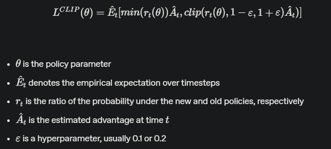

## Video
<iframe width="560" height="315" src="https://www.youtube.com/embed/i_j0A2slDO4?si=VlA7S6z4EPdtg8LG" title="YouTube video player" frameborder="0" allow="accelerometer; autoplay; clipboard-write; encrypted-media; gyroscope; picture-in-picture; web-share" referrerpolicy="strict-origin-when-cross-origin" allowfullscreen></iframe>

## Project Summary
The goal of our project is to train an agent that can navigate rooms to progress through as many floors as possible in a procedurally generated obstacle tower. Each floor will become increasingly difficult as the agent goes up the tower. Each tower is randomized with every floor having a different floor layout so the agent will have to learn to generalize to new obstacles and changes in the environment, such as locked doors, dead ends, and puzzles to progress. Due to the environment being random and partially observable, the agent can’t rely on brute force, pathfinding algorithms, or memorizing the floor layouts to find the exit. It doesn’t have any information about the floor layout and where the exit is located besides the images from what the player model sees as input.

The agent processes its environment by receiving 84x84 pixel image frames, which includes the time remaining and if it has a key embedded in the image, as input. It has to learn to identify the various elements related to progression in the environment, such as keys, time orbs, puzzles, and the different types of doors. The agent can choose to output a variety of actions, or combinations of actions, such as directional movements, turning the camera, and jumping. The success of the agent is measured based on the average number of floors it can reach and the average reward per episode.

## Approaches

### Observation Space:
The agent takes in an 84 x 84 RGB image for its observation and is processed with a convolutional neural network (CNN). The image includes how much time remains and the number of keys possessed.

Since the environment is partially observable, the agent doesn’t have any prior knowledge about the floor layout when it enters a floor. It doesn’t receive the positions of the exit, doors, or keys so it has to rely on its visual input to navigate each floor.

### Action Space:

The agent has a multi-discrete action space consisting of four groups of actions. These action branches are flattened into a discrete action space with 54 actions. Each action the agent chooses represents a combination of the moves below.

- Movement (No-Action, Forward, Back)
- Movement (No-Action, Right, Left)
- Camera Rotation (No-Action, Clockwise, Counter-Clockwise)
- Jump (No-Action, Jump)

Ex.: The action, [1, 0, 1, 1], causes the agent to move forward, turn the camera to the right, and jump simultaneously.

### Rewards:
The obstacle tower is a sparse reward environment with the agent not receiving a reward most of the time for a given state.

- +1 Agent completing a floor
- +0.1 Opening a door
- +0.1 Solving a puzzle
- +0.1 Picking up a key

For each episode, the agent starts off at floor zero and tries to reach an end room to move onto the next floor, with higher floors becoming more complex. The episode ends when the agent runs out of time, reaches floor 100, or touches a dangerous obstacle such as falling into a pit.

The first thing our team had to do was decide on what RL algorithm/algorithms we were going to focus on implementing for the obstacle tower agent. In order to narrow down which algorithms to consider we made a list of the different attributes of the environment.

- Large discrete action space
- Sparse rewards
- Stochastic environment

These factors combined meant that we would likely need a sample-efficient algorithm,  with the large state space and stochastic environment providing a lot of variability in terms of the data the model could train on. After some research we were able to narrow down to three algorithms that we felt could show good results.

- Proximal Policy Optimization (PPO)
- Advantage Actor Critic (A2C)
- Hindsight Experience Replay (HER)

After making this list, we ran a test simulation with the simplest implementation of each algorithm in the default environment to get a sense if any seemed better initially. The results from each algorithm were all about the same, barely even getting a mean reward of 0.2.

### Approach 1: Default PPO on Randomized and Fixed Environment

We eventually settled on Stable Baselines3’s implementation of PPO with the default hyperparameters. PPO collects experiences and compares how much the new policy has changed from the old policy. It clips this probability ratio to keep it within a certain range. Then it takes the minimum of the clipped and unclipped values, making small policy updates and preventing instability. With the vast state and action spaces, we felt that PPO struck a good balance between exploration and stability. This and the fact that from our reading it seemed that PPO works well with ICM, which we would go on to experiment with later.

As our baseline, we trained the agent with a random tower and a different layout in each episode to see how well it would perform without any changes made to the parameters and the environment. Then, we trained another agent on a single/fixed version of the obstacle tower, where the layout doesn’t change.

The agent trained on a single tower trained slower but had a higher mean reward compared to the randomized tower agent. The random tower model struggled to receive any rewards and was stuck on floor 0, whereas the fixed tower model had the advantage of only needing to adapt to the same floor layout.

Even when placed in new towers, the fixed tower agent was able to perform better than the randomized tower agent. Even though the layout is different from the tower it was trained on, it still recognized the doors and exits it needed to go through, unlike the randomized tower agent that performed similarly to an untrained agent.

### Approach 2: Reducing Action Space to 12 Actions

When watching both agents go through the tower, both would often perform random actions instead of heading straight for the doors. This is most likely due to both agents having a hard time associating which action out of the 54 actions would lead to a reward.

To help the agent learn and explore more efficiently, we experimented with reducing the number of actions the agent can choose to lower the complexity. We reduced the actions to only moving forward, turning the camera, and jumping, bringing the action space to 12 combinations

#### New Action space:
- Movement (No-Action, Forward)
- Movement (No-Action)
- Camera Rotation (No-Action, Clockwise, Counter-Clockwise)
- Jump (No-Action, Jump)

By reducing the action space to 12 actions, the agent could generalize to new environments and perform better than the baseline randomized tower agent and the fixed tower agent. Since it had fewer options to choose from, there was a higher chance of choosing the correct action. The new agent had an easier time learning which actions brought it closer to the exit instead of constantly exploring random actions.

This approach also led to a faster training time than the fixed tower agent with similar performance, being able to consistently make it to floor one and sometimes floor 2.

However, reducing the number of actions caused the agent to often get stuck on walls and doorways since it could no longer move backward from obstacles.

### Approach 3: Reducing Action Space to 8

Reducing the action space to 12 actions had a large impact on the agent’s ability to learn so we reduced it further to 8 actions to see if there would be further improvements. 

#### New Action space:
- No actions
- Forward
- Backward
- Turn camera left
- Turn camera right
- Forward + camera left
- Forward + camera right
- Jump + Forward

In our previous approach, the action space included multiple combinations involving the jump action. Although there wasn’t as much random jumping compared to an untrained agent, the agent still jumped when it was unnecessary. We limited the jump action to only one combination where the agent jumps and moves forward at the same time. We also added back the backward movement so that it wouldn’t get stuck as often, but it still sometimes struggled when going through doorways.

Although reducing to 8 actions didn’t provide significant improvement to the agent, it was able to achieve a similar amount of reward faster than the action space of 12 so we kept this approach.

### Approach 4: Hyperparameter Tuning

Next, we focused on optimizing the hyperparameters of PPO to improve performance.

#### Hyperparameters:
- n_steps = 512
- n_epochs = 8
- ent_coef = 0.001

We decreased the n_steps from 2048 to 512 and n_epochs from 10 to 8 for faster updates to the policy since the environment is always changing and for faster training. We also changed the entropy coefficient from 0 to 0.001 to encourage exploring new actions so that it doesn’t converge to using the same actions.

These changes didn’t affect the training speed as much, but it collected more rewards than the agent with the default hyperparameters. This is most likely because of the introduction of entropy causing the agent to explore different actions more so it found better actions than the previous agents.

### Approach 5: Frame skipping and Framestacking

We added a frame skipping parameter of 2 and a frame stacking of 4 on top of the previous approaches. For frame skipping, the agent only takes action every two frames and will return every 2nd frame. This means the agent will repeat an action for two frames and decrease the total training time because the agent doesn’t have to make a decision at every step. This would also help prevent the agent from getting stuck on walls since it could repeat turning away or moving back instead of choosing an action that would get it stuck again.

Then, we combined/stacked the last 4 frames that weren’t skipped into a single observation. In our previous approach, when a door or exit is no longer in view or out of frame, the agent acts like it never saw it in the first place. This causes it to continue searching again by choosing random actions until it sees a door again. By passing in the previous states, the agent is given more information about the environment, such as direction, changes in the environment, and if it saw a door.

- Old Observation Space: (3, 84, 84)
- New Observation Space: (12, 84, 84)

We chose to not use this approach because it didn’t offer any substantial improvements over just reducing the action space and changing the hyperparameters. It took twice as long to reach the same timestep and mean reward. The observation space is increased and the agent has to process four frames instead of just one, slowing down the training speed.

### Approach 6: MLAgents PPO + Curiosity
To deal with the sparse reward environment, we tried using ML agents’ implementation of PPO, from Unity,  with the Intrinsic Curiosity Module to encourage the agent to explore new states. 

Curiosity rewards the agent through intrinsic rewards in addition to the extrinsic rewards by the environment to explore new states and actions. It involves an inverse model and a forward model. The inverse model tries to predict the action that occurred between the current observation and the next observation. The forward model tries to predict the next observation, given the current observation and action taken. The agent is rewarded based on how different the actual next observation is from the forward model’s predicted next observation.

This allows the agent to explore the environment even when there isn’t a reward. However, the model performed worse than the other approaches, only reaching a mean reward of 1 at 3 million timesteps. The only advantage over the other approaches was a faster training time because the obstacle tower is a unity environment. A future goal would be to implement our own ICM to use our modified environment. When training, it kept using the standalone environment game executable so the environment didn't include the reduced action space.

We chose the agent with an action space of 8 and hyperparameter tuning as our best approach because it had the highest mean reward and floor reached, showing that it was able to generalize to the procedurally generated tower.

## Evaluation

### Quantitative:
We evaluated our trained agent by making it run through 5 tower seeds, 1001, 1002, 1003, 1004, 1005. We measured its performance by the average reward per episode during training, the average reward across the 5 seeds, the average floor reached, and the highest floor reached. As the episode mean reward increases by 1, it shows the agent being able to reach a higher floor because the agent is given a reward of 1 for passing a floor.

#### Results from Evaluation Seeds

|       Approach      | Average Reward | Average Floor Reached  |  Highest Floor Reached |
|-----------------------------------------|------|-----|---|
|  Fixed Environment                      | 0.7  | 0.6 | 1 | 
|  Randomized Environment                 | 0.2  | 0.2 | 1 | 
| Fixed Environment with 12 Actions       | 1.16 |  1  | 2 | 
|  Randomized Environment with 12 Actions | 1.3  | 1.2 | 2 | 
|  8 Actions                              | 1.36 | 1.2 | 2 | 
| 8 Actions with Tuned Hyperparameter     | 3.62 | 2.8 | 4 | 
|  Frame Skipping and Frame Stacking      | 2.14 | 1.8 | 3 |  

#### Fixed Environment Agent:

In a fixed environment, the agent showed that it was able to choose the best actions for that specific tower seed and was able to progress further than the agent in a randomized environment. The table, of the results evaluating each approach across five tower seeds, showed that it was also able to adapt better to environments it hadn’t seen before, with a higher average reward and average floor reached compared to the randomized tower agent.

#### Randomized Environment Agent:

In the randomized environment, the agent struggles to generalize to the different environments. It’s not learning and is unable to consistently reach the first floor as shown by the mean reward being below 1. It is only sometimes able to reach the exit of floor 0, performing the same as an untrained agent. We stopped the training early since the reward kept fluctuating up and down without any significant improvements.

#### 12 Actions:

##### Fixed Environment:

##### Randomized Environment:

As shown in the graphs above, reducing the action space greatly improved the performance of the agent, with the reward increasing the most at steps 100,000 to 400,000. Both the fixed agent and randomized tower agent had their average episode reward increased by one, with the fixed agent reaching two floors and the randomized agent reaching floor one. Both were also able to reach a max floor of 2 as shown by the evaluation results.

Despite the fixed agent having a higher episode mean reward than the randomized tower agent, the results from the 5 evaluated towers showed the randomized agent having a similar average reward score and average floor reached. This shows the fixed agent not being able to generalize well after reaching floor 1, while the other agent performs better by having more variations in its experience.

#### 8 Actions:

Reducing the action space to 8 actions showed little improvement in the rewards with the episode reward mean around 1.4-1.5 and the evaluated average reward increasing by only 0.06. Compared to 12 actions, the agent trained faster with a 10-minute difference, making it the better option. Improvements can still be made since both 12 actions and 8 actions started to plateau at around 1.2 million timesteps.

#### 8 Actions with Hyperparameter Tuning:

We changed the hyperparameters with the entropy coefficient having the most impact. Unlike the previous approaches, the reward slowly increased to a max of 2.5 instead of plateauing. Changing the entropy coefficient to 0.001 helped the agent explore new actions instead of converging to an early solution. When looking at results from the 5 tower seeds, tuning the parameters more than doubled the average reward and average floor reached. It also reached floor 4, making it the best agent we have, compared to the other approaches only reaching the 2nd floor.

The training wasn’t as stable as the others with drops in the reward throughout the graph because of the lowered n_steps parameter causing frequent updates with fewer samples. The training also slows down around the second floor because the rooms get more complex with raised platforms and the exit being further away.

#### Frame Skipping and Frame Stacking:

We added frame skipping and frame stacking to improve the agent further because it started improving by small increments after 4.5 million timesteps. Instead of improving the reward, it showed a slight decrease in the episode mean reward. When running it through the 5 tower seeds, the average reward dropped from 3.62 to 2.14 and wasn’t consistently reaching the 2nd floor with only an average floor reached of 1.8. The training time doubled, taking an extra hour to reach the same timestep. This was likely caused by the observation space increasing by four image frames, making the agent take longer to process the input.

Given the decrease in performance and the increased training time, we didn’t continue training the agent with frame skipping and frame stacking.

#### Intrinsic Curiosity Module (ICM):

ML-Agents PPO with the curiosity module didn’t show the improvements we were expecting. The other approaches were able to reach an episode mean reward of 1 at around 500,000 timesteps whereas the curiosity approach took 1 million timesteps. The other approaches had an episode reward above 1 while even after 3 million timesteps, it only hovered around a reward of 1. Although it performed better than the baseline agent on random environments, it was lacking in rewards compared to the other approaches.

### Qualitative:

#### Untrained:
<iframe width="560" height="315" src="https://www.youtube.com/embed/3TaRs6ksSmY" frameborder="0" allowfullscreen></iframe>
The untrained agent chooses actions randomly, resulting in it constantly jumping around in a circle and not making it far from the starting point. It doesn’t make any movements towards the exit.

#### Fixed environment:
<iframe width="560" height="315" src="https://www.youtube.com/embed/RmkP0JfzhB8" frameborder="0" allowfullscreen></iframe>
The agent trained on only one tower showed that it was learning by choosing movements that would help it move toward the exit instead of jumping around randomly. However, it starts to perform like an untrained agent, making random movements and getting stuck on walls when it doesn’t make any progress on the first floor. This shows it might be overfitting to the layout it was trained on and not adapting to different layouts.

#### Randomized environment:
<iframe width="560" height="315" src="https://www.youtube.com/embed/gpOqPXZfvuE" frameborder="0" allowfullscreen></iframe>

We randomized the environment to help the agent learn to generalize to new floor layouts but performed similarly to an untrained agent. It kept choosing random actions, jumping around, and not moving towards the exit. It wasn’t learning and exploring random actions because the agent had to choose the right action out of 54 possible choices. It would only make it out of floor 0 by luck.

#### 12 Reduced Actions:

<iframe width="560" height="315" src="https://www.youtube.com/embed/Pu_LfMn3hiI" frameborder="0" allowfullscreen></iframe>

Reducing the action space showed the biggest improvement with the agent being able to sometimes reach the 2nd floor even on different tower seeds, showing it was generalizing to unseen layouts. The agent recognized doors leading to other rooms and the exit, heading straight for them. Limiting the actions to forward movements caused it to run into walls and doorways more often, having a harder time getting unstuck. Although it wasn’t jumping around in circles, the agent continued to jump when it was unnecessary.

#### 8 Reduced Actions:
<iframe width="560" height="315" src="https://www.youtube.com/embed/9lGVpMPoMzw" frameborder="0" allowfullscreen></iframe>

Reducing the actions further and adding backward movement fixed the issue of constantly jumping. It didn’t get stuck as often as having 12 actions. It continued running into walls until a door or exit appeared in its view where it would head straight for it. It would also move back to the start, confusing the starting point with the exit. Both reduced action spaces helped the agent consistently reach the first floor.

#### 8 Reduced Action and Hyperparameter Tuning:
<iframe width="560" height="315" src="https://www.youtube.com/embed/UKS9ZXeDM0o" frameborder="0" allowfullscreen></iframe>

This was our best agent, consistently reaching the 2nd floor and being able to reach the 4th floor sometimes. It recognized doors and exits the fastest, learning to stop and turn the camera to find them as it trains for longer timesteps. It wasn’t running into walls as often as the previous approaches and could enter another room without getting stuck. It also learned to only jump when it is near a wall to reach a higher platform, reducing the time it takes to navigate rooms.

We also observed the agent getting stuck on curbs. The lighting in the room caused the curbs to blend in with the floor so the agent didn’t jump over them and continued running into them instead.

#### Frame Stacking and Frame Skipping:

<iframe width="560" height="315" src="https://www.youtube.com/embed/cjfKfl8AHqU" frameborder="0" allowfullscreen></iframe>

This agent was slower in exploring rooms than the previous approach. It kept moving around in the same room even when the agent was right next to a door, taking a few seconds before moving through the door or turning away. The agent’s movement was less erratic with it making decisions every two frames instead of every frame. This helped it move away from walls.

## References
**PPO Algorithm**
- [Stable Baselines3 PPO Algorithm](https://stable-baselines3.readthedocs.io/en/v1.7.0/modules/ppo.html)
- [Original Proximal Policy Optimization Algorithms Paper](https://arxiv.org/abs/1707.06347)
- [Improving Generalization](https://arxiv.org/abs/1907.06704)

**Obstacle Tower**
- [Obstacle Tower Environment](https://github.com/Unity-Technologies/obstacle-tower-env)
- [Obstacle Tower Research Paper](https://arxiv.org/abs/1902.01378)
- [Obstacle Tower Evaluation Code](https://github.com/Unity-Technologies/obstacle-tower-env/blob/master/examples/evaluation.py)

**ML-Agents Curiosity**
- [Large-Scale Study of Curiosity-Driven Learning](https://arxiv.org/pdf/1808.04355)
- [Unity Curiosity](https://unity.com/blog/engine-platform/solving-sparse-reward-tasks-with-curiosity)
- [Ml-Agents Configuration Parameters](https://unity-technologies.github.io/ml-agents/Training-Configuration-File/)
- [Training ML-Agents](https://unity-technologies.github.io/ml-agents/Training-ML-Agents/)

**Frame Skipping**
- [Frame Skipping Explaination](https://danieltakeshi.github.io/2016/11/25/frame-skipping-and-preprocessing-for-deep-q-networks-on-atari-2600-games/)
- [Frame Skipping Implementation](https://github.com/compsciencelab/pytorchrl/blob/master/pytorchrl/envs/common.py)

## AI Tool Usage

Used ChatGPT to help troubleshoot installing and setting up the environment because of compatibility errors

<a href="https://mmynampati.github.io/Stairway-to-Heaven/" style="background-color: #4CAF50; color: white; padding: 10px 20px; border-radius: 5px; text-decoration: none; display: inline-block;">
  Return to Main Page
</a>
