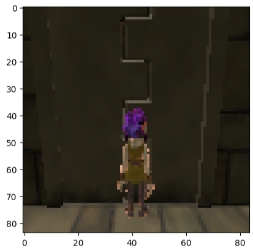
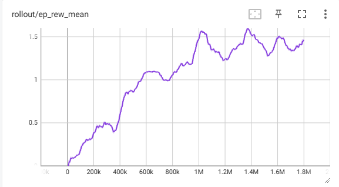

##Video Status Update


## Project Summary
The mission of our project is to create an AI model that trains an agent to navigate a multi-floor obstacle tower by solving puzzles to find the exit to proceed through the various floors. The obstacles that the agent will face range from various things such as symbols, objects, and keys, all of which need to be utilized to unlock doors and solve puzzles. The agent processes its surroundings by receiving image frames as input, from which it must learn to identify the various elements related to progression in the environment. After analyzing the input, the agent can choose to output a variety of actions, or combinations of actions, such as turning and moving. The success of the agent is measured based on the number of floors the agent can clear on average from each timestep.

## Approach
In order to achieve our goal of creating an efficient model that trains AI agents for our environment, our team will be utilizing Stable Baselines3’s Proximal Policy Optimization (PPO) algorithm. PPO is a policy gradient optimization algorithm that in simple terms seeks to weigh the advantages between the old and new policies, and conservatively update the policy during each step. By clipping the value of change any given advantage provides, and always punishing the maximum amount for any negative advantages, this leads the policy to in effect take a long time thinking of what the right move for a given input would be.

The reason that our team chose to implement PPO to solve the obstacle tower challenge is that PPO is very efficient in scenarios involving acting on an environment; this is because its high rate of stability and ability to maximize the amount of training received from each input work well when the agent has a large action space combined with the fact that each input can only effectively be trained on once. One downside to utilizing PPO in this environment is that in order to fully ascertain the effectiveness of the model, it will take a considerable amount of timesteps before the agent’s performance converges to its maximum, requiring a lot of training time.

The agent takes in an 84 x 84 RGB image for its observation and is processed with a convolutional neural network (CNN). The image includes how much time is remaining and the keys pressed.

The agent has a multi-discrete action space consisting of four groups of actions. It can choose a combination of actions to perform. The agent can move forward, backward, right, left, jump, rotate the camera, or perform no movement.

**Action space:**
- Movement (No-Action, Forward, Back)
- Movement (No-Action, Right, Left)
- Camera Rotation (No-Action, Clockwise, Counter-Clockwise)
- Jump (No-Action, Jump)

We flattened the action space into a discrete action space with 54 actions consisting of combinations from the multidiscrete space. The agent only has to choose 1 out of the 54 possible actions.
	
The obstacle tower is a sparse rewarding environment with the agent not receiving a reward most of the time for a given state. The agent is rewarded with the following reward function:

**Rewards:**
- +1 Agent completing a floor
- +0.1 Opening a door
- +0.1 Solving a puzzle
- +0.1 Picking up a key

For each episode, the agent starts off at floor zero and tries to reach an end room to move onto the next floor, with higher floors becoming more complex. The episode ends when the agent runs out of time, reaches floor 100, or touches an obstacle. The agent is trained for a total of 1-1.8 million timesteps using the default Stable Baselines3 PPO hyperparameters

## Evaluation
#### Quantitative:
We evaluated the agent’s performance based on its average reward throughout training. An increase in the reward would indicate that the agent is able to explore a floor such as opening doors or solving puzzles. An increase of 1 would show the agent successfully completing a floor and reaching a higher floor.

We trained the agent in two different scenarios. One on a fixed tower with the same floor layouts and another on randomly selected instances of the tower for generalization.

- **PPO Fixed environment reward graph (No generalization):**

- **PPO Randomly selected environment reward graph (Generalization):**

The agent with no generalization showed an upward trend in reward over time, performing better than the agent trained in random towers. It consistently reached floor 1 and is likely able to go higher with a longer training time. 

The agent's reward for generalization fluctuates throughout training, often dropping in performance and not learning. It isn’t able to reach the first floor most of the time. Although it was trained for a shorter period than the fixed agent, it showed little improvement when compared to the same time steps, so it is unlikely to show improvement when trained for a longer period of time.

#### Qualitative:
We evaluated the agent qualitatively by watching the actions it makes. The agent’s actions should look like it is moving towards doors and other objects. An agent making random actions or getting stuck on walls and obstacles would show the agent isn’t learning.

An untrained agent kept jumping randomly and got stuck on walls while the trained fixed agent showed signs of moving toward doors and moving to the next floor. It didn’t get stuck on walls as often as the untrained agent.

## Remaining Goals and Challenges
In our preliminary implementation of our model involving PPO, our team has already encountered a couple of issues, namely the large action space, long training times, and even considering different reinforcement learning algorithms. The first challenge, action space reduction, we have identified given the nature of how PPO updates the policy. Since the algorithm always gives the maximum penalty and small rewards, the large action space and sparse reward system lead to an incredibly long amount of training time in order to make any improvements. This issue could be addressed by limiting the number of actions that the agent can take, thereby decreasing the amount of time to find optimal ones.

The second challenge, long training times, is a result of how PPO functions work and could potentially be mitigated by tailoring the environment. This could include things such as action space reduction, hyperparameter tuning, and changes to the environment that facilitate the agent learning optimal actions quicker. Currently, the generalized agent sees little to no improvement after 1 million timesteps and takes a considerable amount of time after that to show anything meaningful. 

Lastly, in large part due to the challenges above and spending some time rethinking our approach, our team has looked into other potential substitutes for PPO and has identified Advantage Actor Critic (A2C) as a promising alternative. While A2C is somewhat similar to PPO, it instead specifically relies on a value function, “critic,” to provide stability to the model. Additionally, it is also an on-policy reinforcement learning model that is applicable to the obstacle course environment. While in many regards is seen as not as efficient as PPO, the advantage we believe that A2C might have is the fact that it is usually easier to implement and is less computationally expensive than PPO.

## Resources Used
**PPO Algorithm**
- [Stable Baselines3 PPO Algorithm](https://stable-baselines3.readthedocs.io/en/v1.7.0/modules/ppo.html)
- [Original Proximal Policy Optimization Algorithms Paper](https://arxiv.org/abs/1707.06347)

**Obstacle Tower**
- [Obstacle Tower Environment](https://github.com/Unity-Technologies/obstacle-tower-env)
- [Obstacle Tower Research Paper](https://arxiv.org/abs/1902.01378)
- [Obstacle Tower Evaluation Code](https://github.com/Unity-Technologies/obstacle-tower-env/blob/master/examples/evaluation.py)
